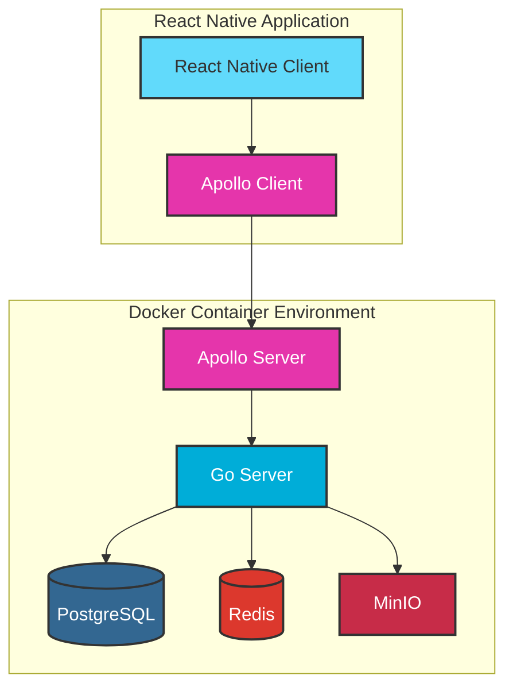

# movex

# Movex - 動画配信アプリ

## 概要
MovexはGo言語のバックエンドとReact Native + TypeScriptのフロントエンドで構築された動画配信アプリケーションです。モノレポ構成を採用し、効率的な開発環境を実現しています。

## プロジェクト構造
```
movex/
├── packages/
│   ├── go/         # Goバックエンド
│   ├── typescript/        # React Nativeフロントエンド
│   ├── shared/          # 共有型定義・ユーティリティ
│   └── tools/           # 開発ツール
├── docs/                # ドキュメント
└── scripts/             # ビルド・デプロイスクリプト
```

## モノレポ構成の利点
- 統一されたバージョン管理
- コード共有の容易さ
- 一貫した開発環境
- 効率的なCI/CD
- 依存関係の一元管理

## 技術スタック
### 共通
- pnpm (パッケージ管理・モノレポ管理)
  - 効率的な依存関係管理
  - 高速なインストール
  - ディスク容量の最適化
- ESLint/Prettier (コード品質)
- Jest (テスト)
- TypeScript (型定義)

### バックエンド
- Go
- Apollo Server
- PostgreSQL (データベース)
- MinIO (動画ストレージ - S3互換)
- Redis (キャッシュ)
- Docker (コンテナ化)
- FFmpeg (動画変換)
  - MPEG-2エンコーディング対応
  - ハードウェアアクセラレーション

### フロントエンド
- React Native
- TypeScript
- Apollo Client
- Expo (開発効率化)

## パッケージ詳細
### backend
- GraphQL APIエンドポイント
- ビジネスロジック
- データベース操作
- ファイルストレージ管理

### frontend
- モバイルアプリUI
- 状態管理
- API通信
- オフライン対応

### shared
- GraphQL型定義
- 共通インターフェース
- ユーティリティ関数
- 定数定義

### tools
- コード生成スクリプト
- 開発補助ツール
- デバッグユーティリティ

## アーキテクチャ
### モノリス構成の利点
- 開発の初速が速い
- デバッグが容易
- デプロイが簡単
- チーム間の連携がスムーズ
- インフラコストの削減

### 主要コンポーネント
1. **アプリケーション層**
   - ユーザー認証
   - 動画管理
   - ソーシャル機能
   - 通知システム

2. **データ層**
   - PostgreSQLでのデータ永続化
   - Redisでのキャッシュ管理
   - MinIOでの動画ファイル管理

## 主な機能
### ユーザー機能
- ユーザー登録・ログイン (JWT認証)
- プロフィール編集
- フォロー/フォロワー管理

### 動画機能
- 動画アップロード
- 動画再生
- 動画一覧表示
- 動画検索
- カテゴリー別表示
- 動画フォーマット変換（MPEG-2対応）

### インタラクション機能
- いいね
- コメント
- 共有機能

### その他
- プッシュ通知
- オフライン再生
- 動画の圧縮・最適化
- FFmpegによる動画変換
  - MPEG-2エンコーディング
  - ビットレート最適化
  - フレームレート調整

## コスト最適化方針
1. **ストレージ**
   - MinIOを使用してS3互換の自己ホスティングストレージを構築
   - 動画の自動圧縮による容量削減

2. **スケーリング**
   - 初期はモノリシックアーキテクチャで開発
   - 必要に応じてマイクロサービス化を検討

3. **開発効率**
   - Expoを活用したクロスプラットフォーム開発
   - Apollo GraphQLによる効率的なAPI開発

4. **インフラ**
   - 初期はシングルサーバーで運用
   - コンテナ化してKubernetesへの移行を容易に

## 開発フェーズ
1. **Phase 1**: MVP開発
   - 基本的なユーザー認証
   - 動画アップロード/再生機能
   - シンプルな一覧表示

2. **Phase 2**: 機能拡充
   - インタラクション機能追加
   - 検索機能の実装
   - プッシュ通知

3. **Phase 3**: パフォーマンス最適化
   - キャッシュ層の追加
   - CDN統合
   - 動画配信の最適化

## インフラ構成



## デプロイメント
- 単一のDockerコンテナとして実行
- docker-composeで関連サービスを管理
- FFmpegを含むコンテナイメージの構築
- 必要に応じて水平スケーリング

## 開発環境セットアップ
### 1. 必要なツールのインストール
#### Windows環境の場合
1. **Go言語のインストール**
   - [Go公式サイト](https://golang.org/dl/)からインストーラーをダウンロード
   - インストーラーを実行し、指示に従ってインストール
   - 環境変数の設定を確認
   ```bash
   go version  # バージョン確認
   ```

2. **Node.jsのインストール**
   - [Node.js公式サイト](https://nodejs.org/)からLTS版をダウンロード
   - インストーラーを実行
   ```bash
   node --version  # バージョン確認
   ```

3. **pnpmのインストール**
   ```bash
   npm install -g pnpm
   pnpm --version  # バージョン確認
   ```

4. **Makeのインストール**
   - [chocolatey](https://chocolatey.org/install)をインストール
   - PowerShellを管理者として実行し、以下のコマンドを実行:
   ```bash
   choco install make
   make --version  # バージョン確認
   ```

#### Mac環境の場合
1. **Homebrewのインストール**
   ```bash
   /bin/bash -c "$(curl -fsSL https://raw.githubusercontent.com/Homebrew/install/HEAD/install.sh)"
   ```

2. **必要なツールのインストール**
   ```bash
   brew install go
   brew install node
   npm install -g pnpm
   ```

### 2. プロジェクトのセットアップ
1. **リポジトリのクローン**
   ```bash
   git clone https://github.com/your-org/movex.git
   cd movex
   ```

2. **依存関係のインストール**
   ```bash
   # バックエンドの依存関係
   cd go/movie-server
   make init

   # フロントエンドの依存関係
   cd ../../
   pnpm install
   ```

3. **開発サーバーの起動**
   ```bash
   # バックエンドサーバー
   cd go/movie-server
   make run

   # フロントエンド開発サーバー（新しいターミナルで）
   cd typescript/movie-app
   pnpm dev
   ```
