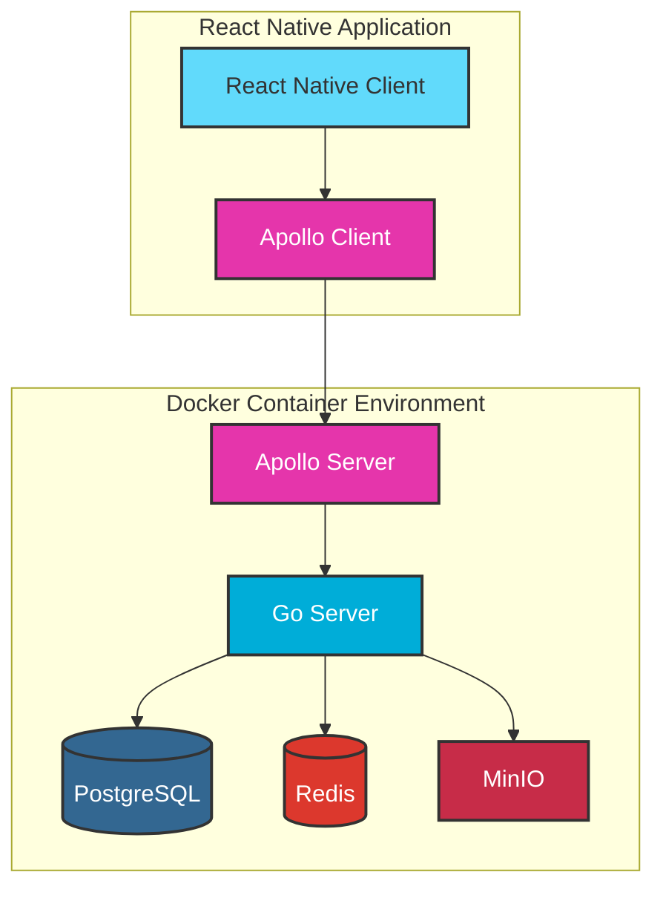

# movex

# Movex - 動画配信アプリ

## 概要
MovexはGo言語のバックエンドとReact Native + TypeScriptのフロントエンドで構築された動画配信アプリケーションです。モノレポ構成を採用し、効率的な開発環境を実現しています。

## プロジェクト構造
```
movex/
├── go/
│   └── movie-server/     # Goバックエンド
├── typescript/
│   └── movie-app/        # React Nativeフロントエンド
├── docs/                 # ドキュメント
└── scripts/              # ビルド・デプロイスクリプト
```

## モノレポ構成の利点
- 統一されたバージョン管理
- コード共有の容易さ
- 一貫した開発環境
- 効率的なCI/CDを組みやすい
- 依存関係の一元管理

## 技術スタック
### バックエンド (go/movie-server)
- Go 1.24
- PostgreSQL (データベース)
- Ent (ORM)
- Wire (依存性注入)
- Zap (ロギング)
- MinIO (動画ストレージ - S3互換)
- Redis (キャッシュ)
- Docker (コンテナ化)
- FFmpeg (動画変換)

### フロントエンド (typescript/movie-app)
- React Native
- TypeScript
- Expo (開発効率化)

## アーキテクチャ
### バックエンド構成
```
movie-server/
├── cmd/                  # エントリーポイント
├── domain/              # ドメインロジック
├── infrastructure/      # インフラ層
├── interface/           # インターフェース層
└── registry/            # 依存性注入
```

### 主要コンポーネント
1. **アプリケーション層**
   - ユーザー認証
   - 動画管理
   - ヘルスチェック

2. **データ層**
   - PostgreSQLでのデータ永続化
   - Redisでのキャッシュ管理
   - MinIOでの動画ファイル管理

## 主な機能
### 動画機能
- 動画アップロード
- 動画再生
- 動画一覧表示
- 動画検索
- カテゴリー別表示

### インタラクション機能
- いいね
- コメント
- 共有機能

## インフラ構成


## 開発環境セットアップ
### 1. 必要なツールのインストール
#### Windows環境の場合
1. **Go言語のインストール**
   - [Go公式サイト](https://golang.org/dl/)からインストーラーをダウンロード
   - インストーラーを実行し、指示に従ってインストール
   - 環境変数の設定を確認
   ```bash
   go version  # バージョン確認
   ```

2. **Node.jsのインストール**
   - [Node.js公式サイト](https://nodejs.org/)からLTS版をダウンロード
   - インストーラーを実行
   ```bash
   node --version  # バージョン確認
   ```

3. **npmの確認**
   ```bash
   npm --version  # バージョン確認
   ```

4. **Makeのインストール**
   - [chocolatey](https://chocolatey.org/install)をインストール
   - PowerShellを管理者として実行し、以下のコマンドを実行:
   ```bash
   choco install make
   make --version  # バージョン確認
   ```

## デプロイメント
### バックエンド
- Dockerコンテナとして実行
- 環境変数による設定
- ヘルスチェックエンドポイント (/health)

2. **必要なツールのインストール**


## 開発フェーズ
1. **Phase 1**: 基盤構築
   - バックエンドAPI実装
   - データベース設計
   - 基本的なフロントエンド実装

2. **Phase 2**: 機能拡充
   - 動画管理機能
   - ユーザー管理
   - インタラクション機能

3. **Phase 3**: 最適化
   - パフォーマンスチューニング
   - セキュリティ強化
   - 運用監視の整備
